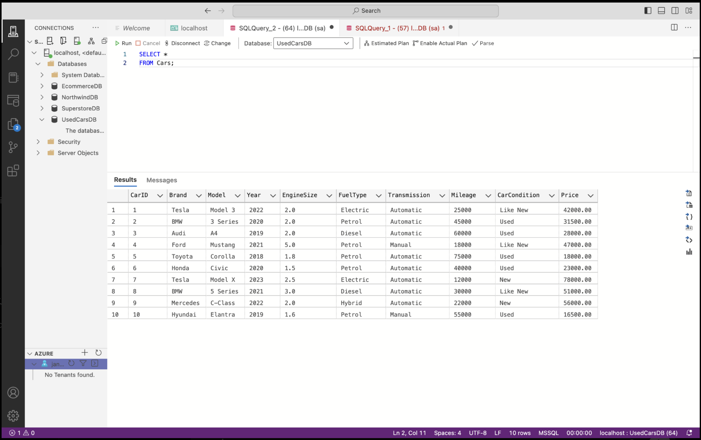
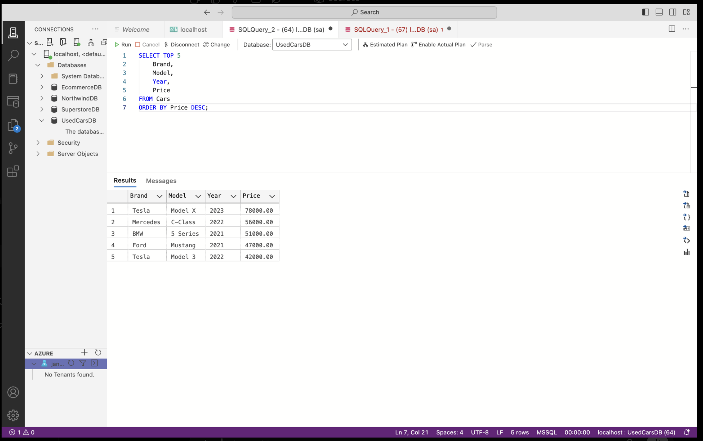

# Used Cars SQL Data Analysis Project

## Project Overview

This project demonstrates the design and analysis of a used-car database using Microsoft SQL Server and Azure Data Studio. The project focuses on transforming raw car information into structured data and extracting meaningful business insights through SQL queries.

The database stores key vehicle information, including brand, model, manufacturing year, engine size, fuel type, transmission, mileage, vehicle condition, and price.

## Objectives

- Design and create a structured relational database for used-car data.
- Create and manage the `Cars` table using SQL.
- Insert and organise vehicle records efficiently.
- Perform exploratory data analysis using SQL queries.
- Analyse vehicle prices across different brands.
- Identify the most expensive vehicles in the dataset.
- Generate insights that can support data-driven decision-making.

## Database Details

- **Database:** `UsedCarsDB`
- **Table:** `Cars`
- **Database Management System:** Microsoft SQL Server
- **Development Environment:** Azure Data Studio

## Key SQL Analysis

The project includes SQL queries for:

- Retrieving and exploring all vehicle records.
- Calculating the total number of cars.
- Calculating the average vehicle price.
- Identifying the highest-priced vehicle.
- Analysing the number of cars available for each brand.
- Calculating the average price by brand.
- Ranking brands based on their average vehicle prices.
- Identifying the top 5 most expensive cars.
- Sorting and filtering data to discover important trends.

## Technologies Used

- Microsoft SQL Server
- Azure Data Studio
- SQL
- GitHub

## Key Insights

- Tesla had the highest average vehicle price in the analysed dataset.
- Vehicle prices varied across brands, models, manufacturing years, and conditions.
- The top-priced vehicles were identified using SQL sorting and ranking techniques.
- Brand-level aggregation provided a clear comparison of vehicle availability and average prices.

## Project Screenshots

### 1. Complete Cars Dataset

### 2. Brand-Level Analysis

### 3. Top 5 Most Expensive Cars

## Skills Demonstrated

- Database Design
- SQL Data Definition Language (DDL)
- SQL Data Manipulation Language (DML)
- Data Retrieval and Filtering
- Aggregation Functions
- `GROUP BY`
- `ORDER BY`
- `TOP`
- Business Data Analysis
- Data Visualisation Through Query Results

## Conclusion

This project demonstrates the complete workflow of creating a SQL database, managing structured data, and performing analytical queries to generate meaningful insights. It highlights practical skills in database development, SQL querying, data analysis, and presenting results through a documented GitHub project.
